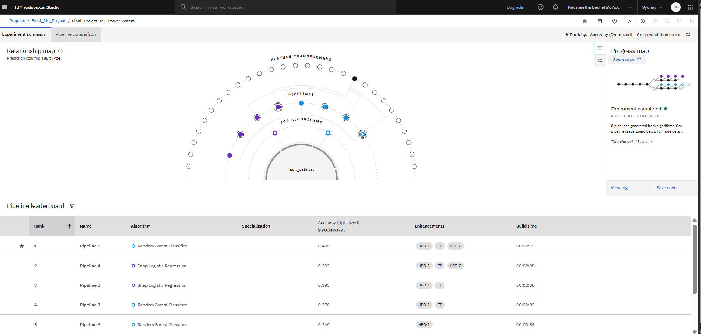
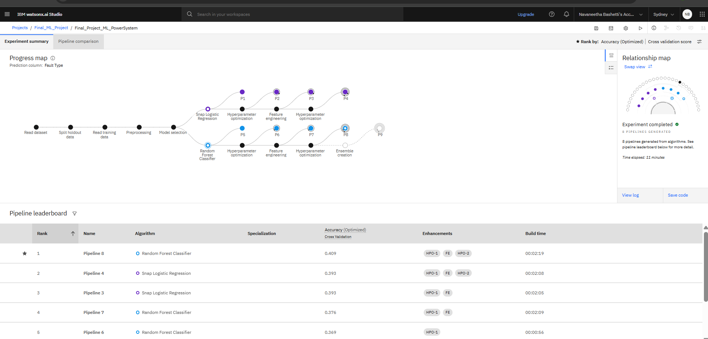
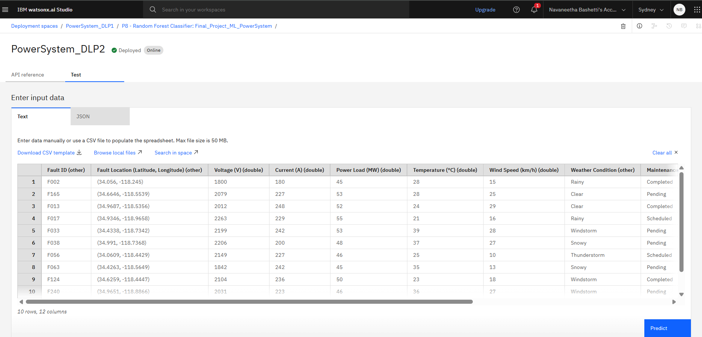
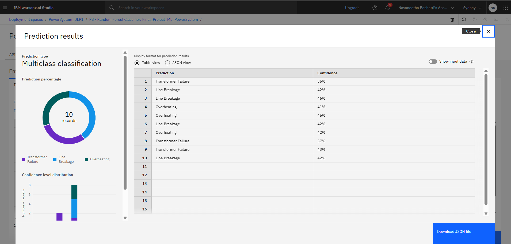

# IBM-Cloud-Project

# Power System Fault Detection and Classification Using Machine Learning

## 📌 Project Overview

This project aims to build a machine learning model to **detect and classify different types of faults** in a power distribution system using electrical measurement data like **voltage and current phasors**.

---

## 🧠 Technologies Used

- **IBM Watsonx.ai Studio** (for model development & deployment)  
- **IBM Cloud Object Storage** (for dataset handling)  
- **Machine Learning Models**:
  - Random Forest Classifier

---

##  System Workflow

1. **Data Collection**  
   Used a publicly available dataset (e.g., from Kaggle) with labeled fault types.

2. **Data Pre-processing**  
   - Handled missing values  
   - Normalized and cleaned the data

3. **Model Training**  
   Trained a Random Forest Classifier to classify fault types.

4. **Model Deployment**  
   Deployed the model using IBM Watsonx.ai with a real-time API for fault prediction.

---

## 📊 Results

The model was able to **accurately classify** fault types based on input voltage and current phasor values. It demonstrated high performance using accuracy, precision, recall, and F1-score.

### Visualization of Results

  
*Confusion Matrix / Model Performance*

  
*Accuracy and Loss Curves*

  
*Fault Type Classification Example*

  
*Prediction Results on Test Data*

---

## 📌 Conclusion

This machine learning model enables:

- Rapid and accurate detection of power system faults  
- Automation of grid monitoring  
- Improved decision-making and fault response time

---
